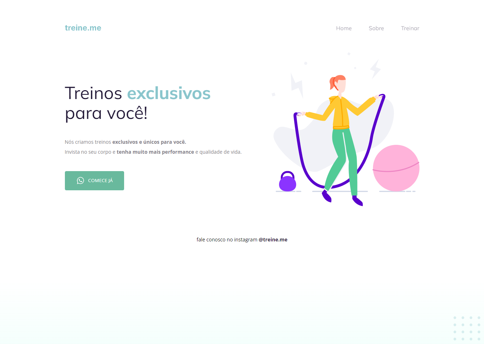

# Explorer Stage 02 - Projeto Treine-me 🏋🏻‍♀️

>Projeto desenvolvido no Stage 02 do programa Explorer da Rocketseat turma 08 🚀

## ⚙ Tecnologias
- HTML
- CSS

[🔗 Clique aqui para acessar](https://brunakarina.github.io./projeto-02/)

 ## 🚀 Alguns conceitos aprendidos no Stage 02:
- Posicionamento de elementos;
- Tags semânticas;
- Conceitos do Box Model;
- Conceitos do Flexbox;
- Acessibilidade;
- Função linear-gradient(); 

## 📫 Contato
- brubskarina@gmail.com