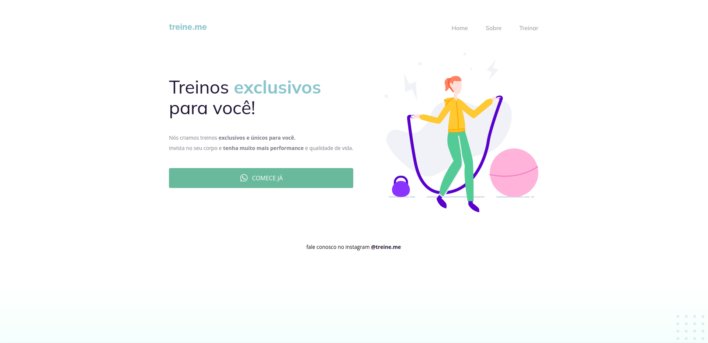

# Stage 02 Desafio - Semântica e acessibilidade 💻 

>Sabemos que a maior parte do conteúdo disponível na internet hoje pode se tornar acessível apenas com a utilização correta dos elementos do HTML.

>Você receberá um código com o projeto desenvolvido durante a Fase 02, mas, ao contrário do que foi feito em aula, ele não apresenta a semântica correta.

>Como você pode ver na imagem abaixo, a página (exceto o botão) continua funcionando normalmente mas, quando você abrir o código, vai se deparar com os elementos do HTML todos bagunçados... 👀

## Desafio Concluído ✔

## ⚙ Tecnologias
- HTML
- CSS

## 📫 Contato
- brubskarina@gmail.com